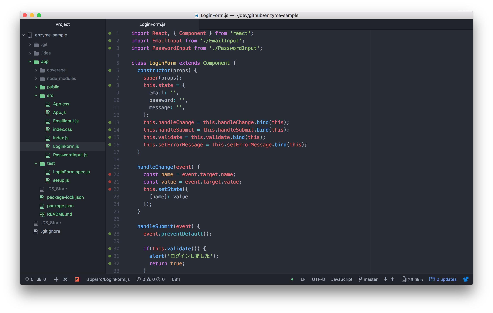
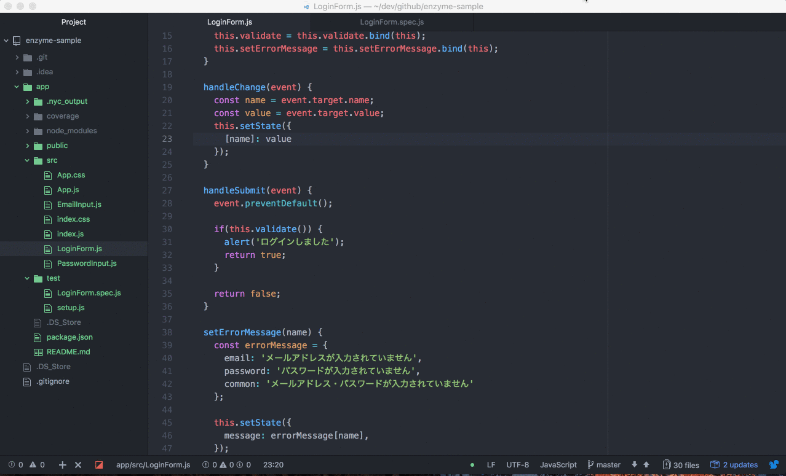

# Coverage Markers

[]()
[](https://atom.io/packages/coverage-markers)
[](https://atom.io/packages/coverage-markers)
[](https://gitter.im/coverage-markers/Lobby?utm_source=badge&utm_medium=badge&utm_campaign=pr-badge&utm_content=badge)

Coverage Markers is Atom package which displays JavaScript test coverage in gutter of editor.

## Features


* Mark covered line numbers in green, uncovered line numbers in red
* Search for lcov file on project directory
* Monitor lcov file and reflect the latest test coverage in the editor
* Support for test coverage measurement tool such as istanbul and nyc

## Installation
```
$ apm install coverage-markers
```

## Usage


This package monitors lcov file (`coverage/lcov.info`) and reflects the coverage in the editor every time the file is changed. The green marker covers the test, the red one does not cover the test.

You can select the `coverage-markers:toggle` command from the atom command palette and use it, or use the application menu `Packages > Coverage Markers > Toggle Coverage`.

**Note: You need to rebuild the package before using it, since this package uses a native module.**

```
$ apm rebuild
```
or rebuild package from Incompatible Packages in the editor.

## License
MIT
