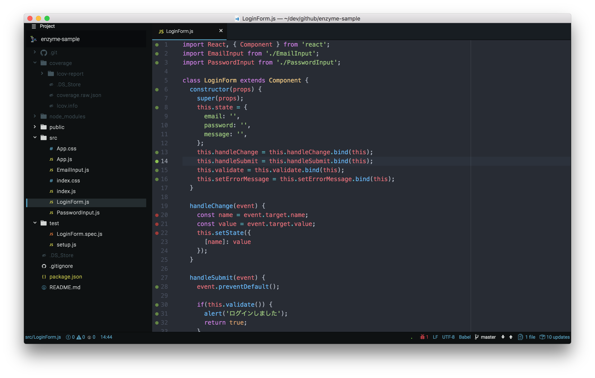

# Coverage Report
Coverage Report is Atom package which displays JavaScript code coverage in gutter of editor.

## Features
* Monitor lcov file and reflect the latest coverage in the editor
* Mark covered lines in green, uncovered lines in red.
* Supports combination of Mocha and Istanbul

## Usage

This package monitors lcov file and reflects the coverage in the editor every time the file is changed. The green line covers the test, the red one does not cover the test.

To display the coverage in the editor, use the application menu `Packages > Coverage Report > Show`. Also, to hide the coverage in the editor, use the application menu `Packages > Coverage Report > Dismiss`

## Todo
* Switch coverage display style with line number highlight and line highlight
* Search for lcov file on project directory
* Cache lcov file
