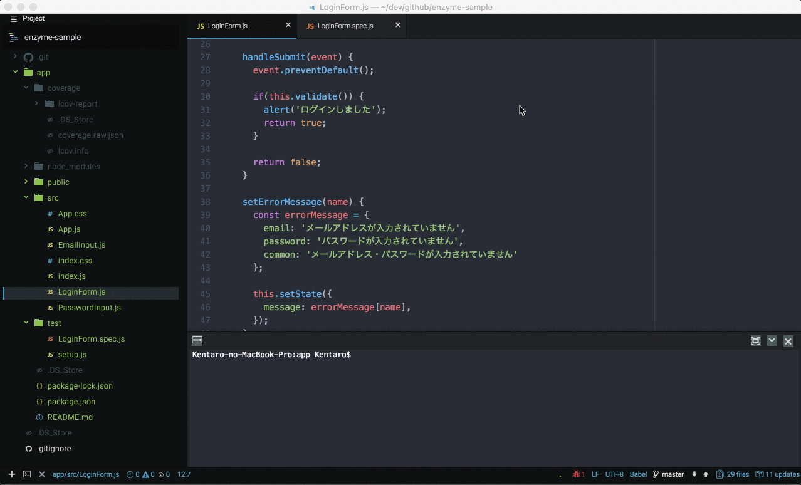

# Coverage Markers

Coverage Markers is Atom package which displays JavaScript code coverage in gutter of editor.

## Features

* Mark covered lines in green, uncovered lines in red.
* Search for lcov file on project directory
* Monitor lcov file and reflect the latest coverage in the editor
* Supports combination of Mocha and Istanbul

## Usage

This package monitors lcov file and reflects the coverage in the editor every time the file is changed. The green line covers the test, the red one does not cover the test.

To display the coverage in the editor, use the application menu `Packages > Coverage Markers > Show Coverage`. Also, to hide the coverage in the editor, use the application menu `Packages > Coverage Markers > Hide Coverage`

## Todo
* Switch coverage display style with line number highlight and line highlight
* Cache lcov file
