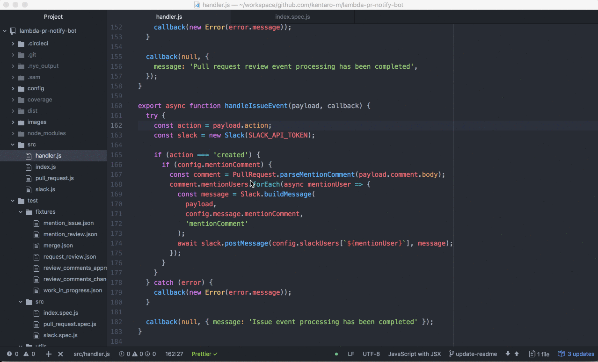

# Coverage Markers

[](https://circleci.com/gh/kentaro-m/coverage-markers)
[](https://atom.io/packages/coverage-markers)
[](https://atom.io/packages/coverage-markers)
[](https://codeclimate.com/github/kentaro-m/coverage-markers/maintainability)
[](https://github.com/kentaro-m/coverage-markers/blob/master/LICENSE.md)

:atom: Atom package to display JavaScript test coverage on gutter of editor.

## Features

* :tv: Display the test coverage from lcov data
* :mag: Search for a lcov file on project directories
* :chart_with_upwards_trend: Monitor a lcov file and redisplay the test coverage everytime it changes
* :angel: Support for the test coverage measurement tool such as istanbul and nyc

## Demo



## Installation

```
$ apm install coverage-markers
```

or go to settings > search for `coverage-markers` and install.

**Note: You need to rebuild the package before using it, since this package uses a native module.**

```
$ apm rebuild
```

or rebuild package from Incompatible Packages in the editor.

## Usage

This package monitors lcov file (`coverage/lcov.info`) and displays the coverage in the editor every time the file is changed. The green marker covers the test, the red one does not cover the test.

You can select the `coverage-markers:toggle` command from the atom command palette and use it

or use the application menu `Packages > Coverage Markers > Toggle Coverage`.

## Contributing

### Issue

* :bug: Report a bug
* :gift: Request a feature

Please use the [GitHub Issue](https://github.com/kentaro-m/coverage-markers/issues) to create a issue.

### Pull Request

1. Fork it (<https://github.com/kentaro-m/coverage-markers/fork>)
2. Create your feature branch
3. Run the test (`$ npm test`) and make sure it passed :white_check_mark:
4. Commit your changes :pencil:
5. Push to the branch
6. Create a new Pull Request :heart:

## License

[MIT](https://github.com/kentaro-m/coverage-markers/blob/master/LICENSE.md)
